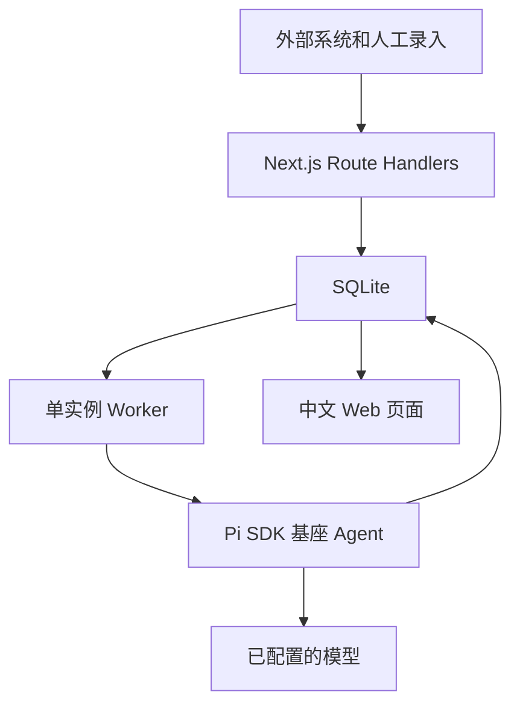

# Customer Intelligence MVP 快速开发方案

> 版本：V1.1 精简版  
> 日期：2026-09-03  
> 技术栈：Next.js + TypeScript Worker + SQLite + Pi SDK Agent + React  
> 开发目标：用最少组件，在 1～2 周内跑通可演示、可试用的业务闭环

---

## 1. 第一版只解决什么

第一版只完成一条核心链路：

```text
会议纪要 / CRM 跟进 / 调研材料 / Agent Session
                         ↓
               POST /v1/ingest
                         ↓
                   原始材料入库
                         ↓
              Worker 调用 Pi Agent
                         ↓
                  Event + Fact
                         ↓
                   客户 Timeline
                         ↓
                   客户当前状态
                         ↓
          Summary + Experience + Next Action
                         ↓
                    中文客户页面
```

系统维护的核心数据：

```text
Customer
  + Source
  + Event
  + Fact
  + State
  + Summary
  + Experience
```

文档只是信息来源，客户当前状态才是页面查询和后续 Agent 使用的数据。

---

## 2. 快速开发原则

第一版遵循以下原则：

1. 单体应用，不拆微服务。
2. 一个 Next.js 全栈服务、一个 TypeScript Worker、一个 SQLite 文件。
3. 只部署单个 Worker，不处理多 Worker 并发。
4. 非结构化内容统一走一个接入接口。
5. Pi 基座 Agent 只通过受控工具读取客户上下文并提交结构化分析，不直接修改数据库。
6. 客户阶段和分类使用简单规则计算。
7. 页面只做总览、客户列表、客户详情三个核心页面。
8. 只保留必要错误信息，不建设完整日志和监控平台。
9. 测试只覆盖最容易造成数据错误的核心路径。
10. 先让真实用户试用，再根据问题补能力。

### 第一版不做

- Neo4j。
- 向量数据库。
- Elasticsearch。
- Redis、Kafka、Celery。
- Multi-Agent。
- 复杂权限系统。
- CRM 双向同步。
- 来源历史版本管理。
- 完整审计系统。
- 完整可观测性平台。
- 大量自动化测试。
- 复杂相似客户算法。
- 以 Chat 作为产品首页。

---

## 3. MVP 功能范围

| 能力 | 第一版 |
|---|---:|
| 创建客户 | ✅ |
| 持续推送文本材料 | ✅ |
| 上传 PDF、DOCX、MD、TXT | ✅ |
| 防止完全重复的数据 | ✅ |
| 根据名称识别客户 | ✅ |
| LLM 提取 Event 和 Fact | ✅ |
| 客户 Timeline | ✅ |
| 自动计算分类、阶段、状态 | ✅ |
| 自动生成客户总结 | ✅ |
| 提炼成功/失败经验 | ✅ |
| 生成下一步建议 | ✅ |
| 查看原始来源 | ✅ |
| 结构化 Event 接口 | ✅ |
| 全文搜索 | 暂不做 |
| 向量搜索 | 暂不做 |
| 复杂客户消歧 | 暂不做 |
| 来源修订历史 | 暂不做 |
| Chat Agent | 暂不做 |

---

## 4. 总体架构



### 4.1 组件职责

| 组件 | 负责内容 |
|---|---|
| Next.js | 接收材料、保存数据、创建任务、提供查询 API，并展示中文页面 |
| SQLite | 保存全部业务数据和处理任务 |
| TypeScript Worker | 异步处理材料、调用 Pi Agent、更新客户状态 |
| Pi SDK Agent | 使用客户画像、事实、时间线和来源读取工具完成分析 |
| 模型 | 在 Pi Agent 编排下提取事件和事实、生成总结与建议 |
| State Engine | 用 TypeScript 规则计算客户分类、阶段、状态 |
| React | 展示总览、客户列表和客户详情 |
| 本地文件目录 | 保存上传的原始文件 |

### 4.2 运行方式

```bash
pnpm dev
pnpm worker
```

第一版只启动一个 API 实例和一个 Worker 实例。

---

## 5. SQLite 使用方式

连接数据库时执行：

```sql
PRAGMA journal_mode = WAL;
PRAGMA synchronous = NORMAL;
PRAGMA foreign_keys = ON;
PRAGMA busy_timeout = 5000;
```

关键约束：

- API 只做短事务。
- LLM 调用期间不持有数据库事务。
- Worker 一次只处理一个任务。
- 所有时间统一保存 ISO 8601 UTC 字符串。
- JSON 数据使用 TEXT 存储，由 Zod 校验。

正确的处理方式：

```text
BEGIN
  保存 Source
  创建 Job
COMMIT

调用 LLM

BEGIN
  保存 Event / Fact
  更新 Customer
  保存 Summary
COMMIT
```

---

## 6. 数据库设计

第一版只保留 8 张业务表：

```text
customers
customer_aliases
source_items
processing_jobs
customer_events
customer_facts
customer_summaries
customer_experiences
```

### 6.1 customers

```sql
CREATE TABLE customers (
    id TEXT PRIMARY KEY,
    name TEXT NOT NULL,
    normalized_name TEXT NOT NULL,
    country TEXT,
    region TEXT,
    industry TEXT,
    owner TEXT,

    category TEXT NOT NULL DEFAULT 'UNTAPPED',
    stage TEXT NOT NULL DEFAULT 'TARGET',
    status TEXT NOT NULL DEFAULT 'ACTIVE',

    profile_json TEXT NOT NULL DEFAULT '{}',
    last_activity_at TEXT,
    created_at TEXT NOT NULL,
    updated_at TEXT NOT NULL
);

CREATE UNIQUE INDEX uq_customers_normalized_name
ON customers(normalized_name);

CREATE INDEX idx_customers_state
ON customers(category, stage, status);
```

`category`：

```text
CONVERTED      已落地
UNCONVERTED    未转化
UNTAPPED       未拓展
```

`stage`：

```text
TARGET
RESEARCH
CONTACTED
DISCOVERY
QUALIFIED
SOLUTION
POC
COMMERCIAL
CONTRACT
DEPLOYMENT
PRODUCTION
EXPANSION
CLOSED_LOST
```

`status`：

```text
ACTIVE
WAITING_CUSTOMER
WAITING_INTERNAL
STALLED
WON
LOST
```

### 6.2 customer_aliases

```sql
CREATE TABLE customer_aliases (
    alias_normalized TEXT PRIMARY KEY,
    alias_display TEXT NOT NULL,
    customer_id TEXT NOT NULL,
    FOREIGN KEY(customer_id) REFERENCES customers(id)
);
```

示例：

```text
Tesco PLC
Tesco UK
TESCO

→ Tesco
```

### 6.3 source_items

所有材料统一放在这一张表，不再建立会议表、邮件表、复盘表。

```sql
CREATE TABLE source_items (
    id TEXT PRIMARY KEY,
    customer_id TEXT,
    source_type TEXT NOT NULL,
    source_system TEXT NOT NULL,
    external_id TEXT NOT NULL,
    title TEXT,
    content TEXT NOT NULL,
    content_hash TEXT NOT NULL,
    file_path TEXT,
    occurred_at TEXT,
    received_at TEXT NOT NULL,
    author TEXT,
    metadata_json TEXT NOT NULL DEFAULT '{}',
    processing_status TEXT NOT NULL DEFAULT 'PENDING',
    error_message TEXT,
    created_at TEXT NOT NULL,
    updated_at TEXT NOT NULL,
    FOREIGN KEY(customer_id) REFERENCES customers(id),
    UNIQUE(source_system, external_id)
);

CREATE INDEX idx_sources_customer_time
ON source_items(customer_id, occurred_at DESC);
```

`source_type`：

```text
MEETING
CRM_FOLLOWUP
RESEARCH
PROJECT_REVIEW
EMAIL
DOCUMENT
AGENT_SESSION
MANUAL_NOTE
OTHER
```

第一版对来源更新采用简单规则：

- `source_system + external_id` 不存在：创建来源。
- 已存在且 `content_hash` 相同：直接返回已有记录。
- 已存在但内容不同：覆盖来源正文，删除该来源旧的 Event 和 Fact，然后重新处理。

这里不保留来源修订历史，以减少开发量。需要修改材料时，外部系统仍使用同一个 `external_id`。

### 6.4 processing_jobs

```sql
CREATE TABLE processing_jobs (
    id TEXT PRIMARY KEY,
    source_item_id TEXT NOT NULL,
    job_type TEXT NOT NULL DEFAULT 'PROCESS_SOURCE',
    status TEXT NOT NULL DEFAULT 'PENDING',
    attempts INTEGER NOT NULL DEFAULT 0,
    error_message TEXT,
    created_at TEXT NOT NULL,
    started_at TEXT,
    finished_at TEXT,
    FOREIGN KEY(source_item_id) REFERENCES source_items(id)
);

CREATE INDEX idx_jobs_status
ON processing_jobs(status, created_at);
```

状态：

```text
PENDING
PROCESSING
DONE
FAILED
```

第一版最多自动重试 2 次。服务重启后，将超过 10 分钟仍处于 `PROCESSING` 的任务恢复为 `PENDING`。

### 6.5 customer_events

```sql
CREATE TABLE customer_events (
    id TEXT PRIMARY KEY,
    customer_id TEXT NOT NULL,
    source_item_id TEXT NOT NULL,
    event_type TEXT NOT NULL,
    occurred_at TEXT NOT NULL,
    summary TEXT NOT NULL,
    importance INTEGER NOT NULL DEFAULT 5,
    confidence REAL NOT NULL DEFAULT 1,
    payload_json TEXT NOT NULL DEFAULT '{}',
    created_at TEXT NOT NULL,
    FOREIGN KEY(customer_id) REFERENCES customers(id),
    FOREIGN KEY(source_item_id) REFERENCES source_items(id)
);

CREATE INDEX idx_events_customer_time
ON customer_events(customer_id, occurred_at DESC);
```

首批 Event 类型：

```text
FIRST_CONTACT
DISCOVERY_COMPLETED
REQUIREMENT_IDENTIFIED
SOLUTION_PRESENTED
POC_PROPOSED
POC_STARTED
POC_COMPLETED
POSITIVE_FEEDBACK
NEGATIVE_FEEDBACK
BUDGET_APPROVED
BUDGET_REJECTED
PROJECT_PAUSED
PROJECT_RESUMED
COMMERCIAL_STARTED
CONTRACT_SIGNED
DEPLOYMENT_STARTED
PRODUCTION_STARTED
EXPANSION_STARTED
LOST
```

### 6.6 customer_facts

```sql
CREATE TABLE customer_facts (
    id TEXT PRIMARY KEY,
    customer_id TEXT NOT NULL,
    source_item_id TEXT NOT NULL,
    fact_type TEXT NOT NULL,
    fact_key TEXT NOT NULL,
    fact_value TEXT NOT NULL,
    confidence REAL NOT NULL DEFAULT 1,
    evidence_text TEXT,
    is_current INTEGER NOT NULL DEFAULT 1,
    created_at TEXT NOT NULL,
    FOREIGN KEY(customer_id) REFERENCES customers(id),
    FOREIGN KEY(source_item_id) REFERENCES source_items(id)
);

CREATE INDEX idx_facts_current
ON customer_facts(customer_id, fact_type, fact_key, is_current);
```

首批 Fact 类型：

```text
REQUIREMENT
BLOCKER
DECISION_MAKER
INFLUENCER
STORE_COUNT
BUDGET
COMPETITOR
PRODUCT_INTEREST
SUCCESS_METRIC
SUCCESS_FACTOR
FAILURE_REASON
PLAYBOOK
NEXT_ACTION
OTHER
```

同一个 `fact_type + fact_key` 出现新值时，将旧值设为 `is_current = 0`，新值设为 `is_current = 1`。

第一版不做复杂冲突分析。无法确认新旧关系时，两条事实都保留，并在 Summary 中提示信息可能冲突。

### 6.7 customer_summaries

```sql
CREATE TABLE customer_summaries (
    customer_id TEXT PRIMARY KEY,
    current_state TEXT NOT NULL,
    key_requirements_json TEXT NOT NULL DEFAULT '[]',
    key_blockers_json TEXT NOT NULL DEFAULT '[]',
    success_factors_json TEXT NOT NULL DEFAULT '[]',
    failure_reasons_json TEXT NOT NULL DEFAULT '[]',
    reusable_playbook_json TEXT NOT NULL DEFAULT '[]',
    next_actions_json TEXT NOT NULL DEFAULT '[]',
    evidence_json TEXT NOT NULL DEFAULT '[]',
    generated_at TEXT NOT NULL,
    FOREIGN KEY(customer_id) REFERENCES customers(id)
);
```

### 6.8 customer_experiences

```sql
CREATE TABLE customer_experiences (
    id TEXT PRIMARY KEY,
    customer_id TEXT NOT NULL,
    experience_type TEXT NOT NULL,
    stage TEXT,
    title TEXT NOT NULL,
    description TEXT NOT NULL,
    action TEXT,
    outcome TEXT,
    confidence REAL NOT NULL DEFAULT 1,
    source_item_ids_json TEXT NOT NULL DEFAULT '[]',
    created_at TEXT NOT NULL,
    FOREIGN KEY(customer_id) REFERENCES customers(id)
);
```

`experience_type`：

```text
SUCCESS
FAILURE
LESSON
PLAYBOOK
WARNING_SIGNAL
```

---

## 7. 持续更新接口

### 7.1 接收文本材料

```http
POST /v1/ingest
Content-Type: application/json
```

请求：

```json
{
  "source_type": "MEETING",
  "source_system": "sales-system",
  "external_id": "meeting-20260903-001",
  "customer": {
    "id": null,
    "name": "Tesco"
  },
  "title": "Tesco PoC 讨论",
  "content": "今天与 Tesco 团队沟通，客户希望先选择 10 家门店进行 PoC……",
  "occurred_at": "2026-09-03T10:00:00+08:00",
  "author": "Jack",
  "metadata": {
    "participants": ["Jack", "James"]
  },
  "auto_create_customer": false
}
```

返回：

```http
HTTP/1.1 202 Accepted
```

```json
{
  "source_id": "src_001",
  "job_id": "job_001",
  "status": "accepted"
}
```

重复数据返回：

```json
{
  "source_id": "src_001",
  "job_id": "job_001",
  "status": "already_exists"
}
```

同一 `external_id` 内容变化返回：

```json
{
  "source_id": "src_001",
  "job_id": "job_002",
  "status": "updated"
}
```

接口不等待 LLM 处理完成。

### 7.2 接收文件

```http
POST /v1/ingest/file
Content-Type: multipart/form-data
```

字段：

```text
file
source_type
source_system
external_id
customer_id 或 customer_name
occurred_at
```

服务端流程：

```text
保存文件
  → 提取正文
  → 创建 Source
  → 创建 Job
  → 后续流程与文本材料相同
```

第一版支持 PDF、DOCX、Markdown 和 TXT。扫描版 PDF 暂不做 OCR。

### 7.3 接收结构化事件

如果 CRM 已经明确给出阶段，不需要再经过 LLM 抽取。

```http
POST /v1/events
```

```json
{
  "customer_id": "cus_001",
  "event_type": "POC_STARTED",
  "occurred_at": "2026-09-03T11:00:00+08:00",
  "summary": "CRM Opportunity 进入 PoC 阶段",
  "source": {
    "system": "salesforce",
    "external_id": "opp_123_stage_4"
  }
}
```

流程：

```text
保存 Source 和 Event
  → State Engine
  → Summary Refresh
```

### 7.4 查询任务状态

```http
GET /v1/jobs/{job_id}
```

```json
{
  "id": "job_001",
  "status": "DONE",
  "attempts": 1,
  "error_message": null
}
```

前端把新建任务记录在本地任务中心，每 1.5 秒查询状态。页面刷新后继续跟踪；任务完成后自动刷新客户详情，失败时展示 `error_message` 并允许重新分析：

```http
POST /v1/jobs/{job_id}/retry
```

重试会保留原失败任务并创建新的 `PENDING` Job。

---

## 8. 客户查询 API

第一版只实现以下接口：

| API | 作用 |
|---|---|
| `POST /v1/customers` | 创建客户 |
| `GET /v1/customers` | 客户列表和筛选 |
| `GET /v1/customers/{id}` | 客户完整视图 |
| `GET /v1/customers/{id}/timeline` | 客户时间线 |
| `GET /v1/customers/{id}/sources` | 原始材料 |
| `POST /v1/customers/{id}/refresh` | 重新生成状态和总结 |
| `GET /v1/jobs/{id}` | 查看任务状态 |
| `POST /v1/jobs/{id}/retry` | 为失败任务创建新的分析任务 |

### 客户列表

```http
GET /v1/customers?category=UNCONVERTED&status=STALLED&page=1&page_size=20
```

### 客户详情返回

```json
{
  "id": "cus_001",
  "name": "Tesco",
  "country": "UK",
  "industry": "Grocery",
  "category": "UNCONVERTED",
  "stage": "POC",
  "status": "STALLED",
  "current_state": "客户完成 PoC 方案讨论，目前因 ROI 和预算审批暂停。",
  "key_requirements": [],
  "key_blockers": [],
  "success_factors": [],
  "failure_reasons": [],
  "reusable_playbook": [],
  "next_actions": [],
  "recent_events": []
}
```

---

## 9. 客户识别

第一版使用简单规则：

```text
显式 customer_id
  → 客户名称精确匹配
  → Alias 精确匹配
  → auto_create_customer=true 时创建新客户
  → 否则拒绝并提示先新建客户
```

名称处理：

- 转小写。
- 去除首尾空格。
- 合并连续空格。
- 去除 `PLC`、`Ltd`、`Inc` 等常见后缀后用于匹配。

第一版不做模糊匹配和 LLM 消歧，避免错误合并客户。

人工页面将“新建客户”和“更新材料”分为两个入口；更新材料必须选择已有客户，并支持粘贴文本或上传文件。外部系统只有显式传入 `auto_create_customer=true` 时，名称无法匹配才自动创建客户，避免拼写差异产生重复档案。发现重复客户时由管理员手工添加 Alias 并合并，合并功能可在 V1.1 实现。

---

## 10. Pi 基座 Agent 抽取

### 10.1 输入

一次抽取只传：

```text
客户基本信息
当前关键 Facts
本次 Source 内容
允许的 Event 和 Fact 类型
```

不读取客户全部历史文档。

### 10.2 Agent 工具

Pi Agent 禁用内置文件与 Shell 工具，只启用以下客户域工具：

- `get_customer_profile`：读取当前客户画像与旧总结。
- `read_source_material`：读取本次任务的完整材料。
- `list_current_facts`：读取当前有效事实。
- `list_customer_timeline`：读取最近客户事件。
- `submit_customer_analysis`：提交最终 Event、Fact 和 Next Action，并终止本轮。

所有查询工具都被限制在当前任务客户和来源范围内。Agent 不能直接写数据库。

### 10.3 固定输出

```json
{
  "events": [
    {
      "event_type": "POC_PROPOSED",
      "occurred_at": "2026-06-12T00:00:00Z",
      "summary": "客户提出选择 10 家门店开展 PoC",
      "importance": 8,
      "confidence": 0.95,
      "evidence_text": "先选择10家门店进行POC"
    }
  ],
  "facts": [
    {
      "fact_type": "REQUIREMENT",
      "fact_key": "poc_scope",
      "fact_value": "10 stores",
      "confidence": 0.92,
      "evidence_text": "先选择10家门店进行POC"
    }
  ],
  "next_actions": [
    {
      "action": "确认 PoC 的 ROI 衡量指标",
      "reason": "当前材料没有规模化收益模型"
    }
  ]
}
```

### 10.4 最少校验

- 输出能通过 Zod Schema。
- Event 和 Fact 类型在白名单中。
- `confidence` 在 0 到 1 之间。
- `importance` 在 1 到 10 之间。
- Pi Agent 输出失败时重试一次；不可用时按配置回退到兼容抽取器。
- 第二次仍失败，将 Job 标为 `FAILED` 并保存错误原因。

模型不能直接调用数据库，只返回 JSON。

---

## 11. Fact 更新规则

第一版只使用简单合并策略：

```text
同一个 customer_id
  + fact_type
  + fact_key
```

出现新值时：

```text
旧 Fact.is_current = 0
新 Fact.is_current = 1
```

例如：

```text
3 月：预算 = 未批准
7 月：预算 = 已批准
```

最终当前事实为已批准，旧事实继续保留用于历史查看。

对于可以同时存在的事实，例如多个需求、多个竞争对手，`fact_key` 应包含具体对象，避免相互覆盖。

---

## 12. State Engine

Pi Agent 负责通过受控工具把自然语言抽取成标准 Event，State Engine 负责确定客户状态。

### 12.1 Event 到 Stage

| Event | Stage |
|---|---|
| `FIRST_CONTACT` | `CONTACTED` |
| `DISCOVERY_COMPLETED` | `DISCOVERY` |
| `REQUIREMENT_IDENTIFIED` | `QUALIFIED` |
| `SOLUTION_PRESENTED` | `SOLUTION` |
| `POC_PROPOSED`、`POC_STARTED`、`POC_COMPLETED` | `POC` |
| `COMMERCIAL_STARTED` | `COMMERCIAL` |
| `CONTRACT_SIGNED` | `CONTRACT` |
| `DEPLOYMENT_STARTED` | `DEPLOYMENT` |
| `PRODUCTION_STARTED` | `PRODUCTION` |
| `EXPANSION_STARTED` | `EXPANSION` |
| `LOST` | `CLOSED_LOST` |

按 `occurred_at` 对全部 Event 排序后重算，历史材料晚到也不会直接覆盖当前阶段。

### 12.2 Category

```text
CONTRACT / DEPLOYMENT / PRODUCTION / EXPANSION
  → CONVERTED

发生过 CONTACTED 以上推进，但尚未签约落地
  → UNCONVERTED

仍处于 TARGET / RESEARCH，没有有效推进
  → UNTAPPED
```

### 12.3 Status

```text
出现 LOST
  → LOST

出现 CONTRACT_SIGNED / DEPLOYMENT_STARTED / PRODUCTION_STARTED
  → WON

最近状态事件为 PROJECT_PAUSED
  → STALLED

最近状态事件为 PROJECT_RESUMED
  → ACTIVE

超过 60 天没有关键 Event
  → STALLED

其他
  → ACTIVE
```

第一版所有阶段统一使用 60 天停滞阈值，不做分阶段配置。

---

## 13. Summary 和 Experience

### 13.1 Summary 输入

```text
Customer
+ 当前 Facts，最多 30 条
+ 最近 Events，最多 20 条
+ 高重要度历史 Events，最多 10 条
+ 旧 Summary
```

### 13.2 Summary 输出

- 当前状态。
- 关键需求。
- 关键阻碍。
- 成功因素。
- 失败原因。
- 可复用打法。
- 下一步建议。
- 相关 Source ID。

### 13.3 刷新时机

每次 Source 处理成功后，直接刷新该客户的 State、Summary 和 Experience。

第一版客户材料量不大，这样实现最简单。后续出现成本或速度问题，再改成按重要事件刷新。

---

## 14. Worker

Worker 循环：

```text
查询最早的 PENDING Job
  → 标记 PROCESSING
  → 读取 Source
  → 识别 Customer
  → 调用 Pi Agent
  → 保存 Event 和 Fact
  → 重算 State
  → 生成 Summary 和 Experience
  → 标记 DONE
```

伪代码：

```python
def process_source(job_id: str):
    job = load_job(job_id)
    source = load_source(job.source_item_id)
    customer = resolve_customer(source)

    result = llm_extract(
        customer=customer,
        current_facts=get_current_facts(customer.id),
        content=source.content,
    )

    validated = ExtractionResult.model_validate(result)

    save_extraction_and_state(
        customer_id=customer.id,
        source_id=source.id,
        result=validated,
    )

    summary = generate_summary(customer.id)
    save_summary(customer.id, summary)
    mark_job_done(job.id)
```

所有 Pi Agent / 模型请求都在数据库事务外执行。数据库只在保存结果时开启短事务。

---

## 15. 中文 UI

第一版只做三个页面。

### 15.1 总览页

```text
客户情报中心

已落地       23
未转化       41
未拓展      128

最近发生变化

Tesco       POC · 停滞       2 小时前
Carrefour   POC · 活跃       昨天
Lidl        已联系 · 活跃    昨天
```

需要的模块：

- 三类客户数量卡片。
- 最近更新客户。
- 停滞客户列表。
- 搜索框，只按客户名称搜索。

### 15.2 客户列表页

筛选：

- 分类。
- 阶段。
- 状态。
- 国家。
- 行业。

表格字段：

```text
客户
国家/区域
行业
分类
阶段
状态
最后活动时间
```

### 15.3 客户详情页

```text
Tesco
英国 · 食品零售

[未转化] [POC] [停滞]

当前状态
客户已完成 PoC 方案讨论，当前主要受 ROI 和预算审批影响。

关键需求
• Loss Prevention
• Store Operation

关键阻碍
• ROI 不明确
• 预算审批未通过

时间线
09/03 项目暂停
08/25 预算未通过
08/03 PoC 方案确认

失败经验
PoC 前没有完成商业 ROI 论证。

下一步建议
1. 补充 ROI 模型
2. 寻找业务 Sponsor
3. 重新推动小规模 PoC

原始材料
• Tesco PoC 讨论会议纪要
• CRM 跟进记录
```

每条 Event 和 Fact 保留 `source_item_id` 与逐字 `evidence_text`。用户可从需求、阻碍、洞察、经验、建议和时间线打开证据抽屉，直接定位并高亮原始材料中的对应段落；第一版不做来源版本对比。

---

## 16. 项目目录

```text
customer-intelligence/
├── src/
│   ├── app/
│   │   ├── api/v1/
│   │   └── customers/
│   ├── components/
│   ├── lib/
│   │   ├── db.ts
│   │   ├── ingestion.ts
│   │   ├── pi-agent.ts
│   │   ├── extractor.ts
│   │   ├── file-parser.ts
│   │   ├── state-engine.ts
│   │   ├── summary.ts
│   │   └── processor.ts
│   └── worker/
│       └── main.ts
├── data/
│   ├── app.db
│   └── files/
├── tests/
│   └── core-flow.test.ts
├── package.json
├── .env.example
└── README.md
```

不需要一开始建立过多 Repository、Adapter 和领域分层。业务代码量增加后再拆分。

---

## 17. 最小配置

```dotenv
DATABASE_PATH=./data/app.db
FILE_STORAGE_PATH=./data/files
API_TOKEN=

PI_AGENT_ENABLED=true
PI_AGENT_MODEL=dmall-router/glm-5.3-zp
PI_AGENT_THINKING=high
PI_AGENT_TIMEOUT_MS=120000
PI_AGENT_CHAT_THINKING=high
PI_AGENT_CHAT_TIMEOUT_MS=90000
PI_AGENT_FALLBACK=true

LLM_BASE_URL=
LLM_API_KEY=
LLM_MODEL=
LLM_TIMEOUT_SECONDS=60000

WORKER_POLL_INTERVAL_MS=1000
MAX_UPLOAD_MB=30
LOG_LEVEL=INFO
```

---

## 18. 最小日志和错误处理

第一版只使用 Node.js 控制台日志，不接入 ELK、OpenTelemetry、Prometheus 或独立日志服务。

API 只记录请求失败，Worker 只记录 Job 处理失败。成功请求无需逐条记录业务详情。

不记录完整客户正文、LLM Prompt 和密钥。

Job 表中的 `error_message` 用于页面或接口查看失败原因，不再设计独立日志表。

健康检查只提供：

```http
GET /health
```

能访问 SQLite 就返回：

```json
{
  "status": "ok"
}
```

---

## 19. 最少测试

第一版不追求覆盖率，只保留 5 个核心测试：

1. `POST /v1/ingest` 能创建 Source 和 Job。
2. 相同 `source_system + external_id + content_hash` 重复发送时不会重复处理。
3. Worker 能把一份固定材料转成 Event、Fact 和 Summary。
4. `CONTRACT_SIGNED` 能得到 `category=CONVERTED`、`stage=CONTRACT`、`status=WON`。
5. Job 处理失败时会标记 `FAILED`，服务重启后 `PENDING` Job 仍存在。

测试中不真实调用 LLM，使用一份固定 JSON Mock。

另外准备 3 份人工试用材料：

```text
成功签约客户
PoC 停滞客户
尚未接触客户
```

开发完成后手工走一遍页面即可。先通过真实试用发现问题，再补测试。

---

## 20. 开发计划

### 第 1 阶段：接入和 Timeline，2～3 天

- 建表和 SQLite 初始化。
- `POST /v1/customers`。
- `POST /v1/ingest`。
- Job Worker。
- LLM 提取 Event 和 Fact。
- Timeline 查询。

完成标志：推送会议纪要后，可以在接口中查到客户事件。

### 第 2 阶段：状态和总结，2～3 天

- Fact 更新。
- State Engine。
- Summary 和 Experience。
- 客户列表、详情 API。

完成标志：客户可以自动得到分类、阶段、状态和下一步建议。

### 第 3 阶段：中文页面，2～3 天

- 总览页。
- 客户列表页。
- 客户详情页。
- 原始材料查看。

完成标志：业务人员不通过 API 也能完成基本查看。

### 第 4 阶段：文件和收尾，1～2 天

- 文件上传和文本解析。
- 结构化 Event 接口。
- 核心链路测试与真实项目案例验收脚本。
- 本地运行配置和 README。

整体目标：一名工程师配合 Code Agent，在 7～11 个工作日内完成可试用版本。

---

## 21. 验收标准

- [x] 可以创建客户。
- [x] 可以持续推送客户文本材料。
- [x] 可以上传 PDF、DOCX、MD、TXT。
- [x] 重复推送不会产生重复数据。
- [x] 一条材料可以抽取 Event 和 Fact。
- [x] 可以形成客户 Timeline。
- [x] 可以计算 category、stage、status。
- [x] 可以生成当前总结、经验和下一步建议。
- [x] 可以从结论定位并高亮对应的原始材料证据。
- [x] Worker 失败后可以看到错误，服务重启后任务不丢失。
- [x] 中文客户列表、详情工作台和来源阅读界面可以正常使用。

第一版不设置测试覆盖率、P95 延迟、抽取 Precision 等正式指标。先收集真实客户材料和用户反馈，再建立评估集。

---

## 22. 给 Code Agent 的开发约束

```text
1. 使用 Next.js、React、TypeScript、Zod、Node.js `node:sqlite`。
2. 使用一个 Next.js 进程和一个 TypeScript Worker 进程。
3. 不引入 Redis、Kafka、Celery、Neo4j、Elasticsearch 和向量数据库。
4. POST /v1/ingest 保存数据后立即返回 202，不等待 LLM。
5. Worker 从 processing_jobs 表读取任务。
6. LLM 只返回固定 JSON，不生成 SQL，不直接操作数据库。
7. category、stage、status 使用纯 TypeScript 规则计算。
8. 相同 source_system + external_id 必须幂等。
9. 核心链路使用 Vitest 覆盖，真实项目案例另提供可重复运行的验收脚本。
10. 先完成后端闭环，再开发页面。
11. UI 所有业务文案使用中文。
12. 第一版优先代码清晰和功能跑通，不做提前抽象。
```

推荐先实现这一条最小垂直链路：

```text
POST /v1/ingest
  → source_items
  → processing_jobs
  → Worker
  → 一个 POC_PROPOSED Event
  → stage = POC
  → GET /v1/customers/{id}
```

这条链路跑通后，再增加更多事件类型、Summary、Experience 和页面。

---

## 23. 后续再增加

真实试用验证有效后，再根据需求增加：

- 客户合并和更完善的消歧。
- 来源修订历史。
- 人工修正 Fact 和 State。
- 中文全文搜索。
- 相似客户推荐。
- OCR。
- CRM 和会议系统连接器。
- Agent Session 自动接入。
- 权限、审计和完整日志。
- PostgreSQL 和多 Worker。
- Chat Agent。

---

## 24. 最终交付边界

第一版只需要稳定完成：

```text
一条新材料进入系统
  → 被归入一个客户
  → 形成 Event 和 Fact
  → 更新客户状态
  → 生成可读总结和下一步建议
  → 在中文页面中展示
  → 从结论定位并高亮原始证据
```

这条链路能在真实客户材料上运行，MVP 就已经达到目的。其他能力根据试用反馈继续增加。
